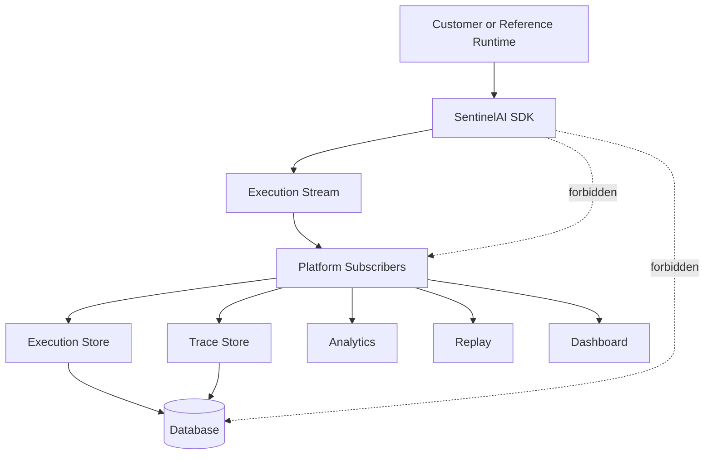
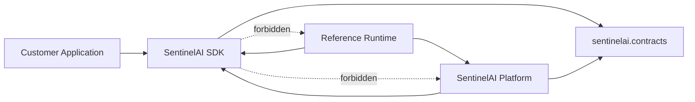

# SentinelAI Architecture

SentinelAI is an execution-stream-driven AI observability system. The SDK
produces immutable telemetry facts; optional Platform subscribers decide what
to persist, analyze, replay, display, search, or forward.

## Execution Stream as the core domain concept

An AI execution is not primarily a database row. It is an ordered history of
facts:

```text
ExecutionStarted
  → TraceCreated
  → SpanStarted / SpanCompleted
  → VerificationCompleted
  → AnalysisCompleted
  → TraceCompleted
  → ExecutionCompleted | ExecutionFailed | ExecutionCancelled
```

`sentinelai.execution_stream` represents that history. It is a domain boundary,
not a Kafka/RabbitMQ abstraction. The package contains:

- `event.py`: immutable event envelopes and concrete execution facts;
- `publisher.py`: the producer-side publication contract;
- `subscriber.py`: the consumer-side handling contract;
- `stream.py`: the combined `ExecutionStream` contract and process-local
  `InMemoryExecutionStream`;
- `schemas.py`: deeply immutable payload/metadata helpers.

New facts such as `PlannerCompleted`, `RetrieverCompleted`, or `LLMCompleted`
can be introduced as new `ExecutionEvent` subclasses. Existing stream and
subscriber code does not require a switch statement or modification.

## Why immutable facts

Events describe what happened, not what the current mutable state happens to
be. Their envelope, payload, metadata, and nested collections are immutable.
This provides:

- deterministic replay and evaluation inputs;
- append-only audit history;
- independent consumers with no shared mutable state;
- safe fan-out to persistence, analytics, dashboards, or notifications;
- transport-neutral serialization for future distributed execution.

An event is published once. Consumers may build different projections from the
same fact without changing the producer.

## Why the SDK emits instead of persists

The SDK runs inside customer applications. It cannot assume that customers use
PostgreSQL, Supabase, FastAPI, a SentinelAI-hosted backend, or any persistence
at all.

Customer integrations therefore use:

1. `configure(...)` once at the composition root;
2. `@execution(...)` around an execution boundary;
3. `@span(...)` around operations; stage state is inferred by the SDK.

Internally, `execution()` uses a private lifecycle engine to:

1. collect execution and trace telemetry;
2. publish lifecycle, trace, span, verification, analysis, and terminal
   events through the Execution Stream;
3. leave Execution Views such as `ExecutionSnapshot` to Platform projections.

It does not call repository or storage methods. Customers should never
construct `ExecutionContext`, return `ObservedResult`, call `record_metadata`,
or use repository/persistence APIs from business code.

## Product boundaries

### SentinelAI SDK (`sentinelai`)

Active telemetry path:

- `sdk`: configure-once settings, `execution()`, `span()`, ambient correlation;
- `contracts`: language-neutral Execution Protocol DTOs for Python;
- `execution`: internal lifecycle engine and active-execution ContextVar;
- `tracing`: span instrumentation and in-process trace collection;
- `execution_stream`: immutable events, publication contracts, and in-memory
  asynchronous fan-out;
- `plugins`: instrumentation plugin protocol.

The language-neutral protocol specification lives in `protocol/`.

The active telemetry path depends only on Pydantic and the Python standard
library. It has no Platform, FastAPI, SQLAlchemy, Supabase, Qdrant, dashboard,
analytics, or storage implementation dependencies.

Repository/storage protocol exports remain temporarily for public import
compatibility, but execution code no longer imports or invokes them. They are
scheduled for removal in the next major API version.

### SentinelAI Platform (`sentinelai_platform`)

The optional backend consumes the SDK stream:

- `event_subscribers`: persistence projections for execution and trace facts;
- `execution_store`: existing trace persistence behavior;
- `persistence.postgres`: SQLAlchemy models, repositories, sessions, and
  Alembic migrations;
- `storage`: local and Supabase implementations;
- `api`: FastAPI read endpoints;
- `replay`, `evaluation`, `analytics`, `dashboard`: reserved future
  subscriber products.

Platform subscribers translate events into the existing repositories. The
database schema and persistence business behavior remain unchanged.

### Reference Runtime (`examples/reference_runtime`)

The reference runtime remains a customer application with planner, executor,
retriever, verifier, analyzer, invoice, Qdrant, and business API logic.

Its composition root creates an `InMemoryExecutionStream`, registers Platform
persistence subscribers, and calls `configure(publisher=stream, ...)`. Runtime
write paths use `@observe_execution` / `@observe(capture=...)` and never call
repositories directly. Existing Platform read APIs still query persisted
projections.

## Dependency direction



The Platform imports SDK contracts and stream abstractions. The SDK never
imports the Platform or reference runtime.

## In-memory delivery semantics

`InMemoryExecutionStream` is the only implementation:

- subscription is by event class;
- subscribing to `ExecutionEvent` receives all present and future events;
- duplicate subscriptions are ignored;
- `unsubscribe()` removes the exact subscriber registration;
- matching subscribers are awaited concurrently;
- publication returns only after matching subscribers finish;
- subscriber failures propagate after fan-out completes.

Trace persistence remains best-effort at the Platform subscriber, preserving
existing runtime behavior when object storage is unavailable.

## OpenTelemetry analogy

OpenTelemetry SDKs produce telemetry signals without deciding which vendor,
database, or backend owns them. Exporters and collectors consume those signals.

SentinelAI follows the same separation for AI execution intelligence:

```text
OpenTelemetry signal  ≈ SentinelAI ExecutionEvent
OTel SDK               ≈ SentinelAI SDK
Exporter/collector     ≈ Platform subscriber
Backend projection     ≈ execution, trace, analytics, replay, dashboard store
```

This keeps customer instrumentation stable while backend capabilities evolve.

## Distributed future

Kafka, RabbitMQ, Redis Streams, NATS, and EventBridge are not implemented.
Future transports can implement `ExecutionStream` or bridge published
`ExecutionEvent` envelopes without changing `ExecutionContext`, tracing,
customer runtimes, or event subscribers.

The in-memory implementation is intentionally sufficient for the current
single-process reference runtime. Distributed ordering, retries, delivery
guarantees, idempotency, and dead-letter policies belong to future transport
implementations and Platform subscriber policy—not the SDK domain model.

## Persistence and migrations

No schema migration accompanies this refactor. The historical Alembic chain
remains under:

`sentinelai_platform/persistence/postgres/migrations/versions`

Revision IDs remain `0001_initial`, `0002_execution_snapshots`, and
`0003_document_ownership_note`. Snapshot insertion remains append-only, and
trace rows are still flushed before span rows.
# SentinelAI Architecture

SentinelAI is organized as three products in one repository. This is a package
boundary, not a microservice boundary.

## Products

### SentinelAI SDK (`sentinelai`)

The installable core used inside customer applications:

- `contracts`: runtime-agnostic Pydantic DTOs.
- `execution`: mutable execution lifecycle and immutable snapshot creation.
- `tracing`: `observe`, trace context, spans, and in-process tracing.
- `repositories`: persistence protocols only.
- `ports`: the minimal `StorageProvider` interface.
- `plugins`: the plugin protocol; no framework plugins are implemented.

The SDK has one required dependency: Pydantic. It has no HTTP framework,
database ORM, storage client, vector database, dashboard, or customer runtime
knowledge.

### SentinelAI Platform (`sentinelai_platform`)

The optional backend built on the SDK:

- `api`: FastAPI application/router for health, execution, and trace reads.
- `execution_store`: snapshot/trace persistence orchestration.
- `persistence.postgres`: SQLAlchemy repositories, models, sessions, and
  Alembic migrations.
- `storage`: local and Supabase implementations of the SDK storage interface.
- `replay`, `evaluation`, `analytics`, `dashboard`: reserved Platform
  namespaces with no engines or UI implemented yet.

Platform code may import the SDK. The SDK must never import Platform code.

### Reference Runtime (`examples/reference_runtime`)

An example customer application:

- planner, executor, retriever, verifier, analyzer;
- OpenRouter client, Qdrant, embeddings, and invoice extraction;
- `/query` and `/documents` business APIs;
- document models/repositories and sample data.

The runtime consumes the SDK and opts into Platform persistence/API packages.
Its business schemas, including `VerificationResult` and `RootCauseAnalysis`,
remain runtime-owned.

## Dependency direction



Architectural tests parse SDK imports and reject FastAPI, Supabase, SQLAlchemy,
Qdrant, Platform, and reference-runtime dependencies.

## Contracts

`sentinelai.contracts` contains shared data only:

- `ExecutionSnapshot`, `ExecutionSummary`, `ExecutionRecord`;
- `ExecutionStatus`, `TerminalExecutionStatus`;
- `ModelInfo`, `PromptReference`, `SnapshotCreationMetrics`;
- `Trace`, `Span`, `TraceRecord`, `SpanRecord`, `SpanStatus`.

Contracts contain no orchestration or business rules. Snapshot stage payloads
remain JSON-shaped dictionaries so customers can use their own planner,
retrieval, verification, and analysis models.

`VerificationResult`, `RootCauseAnalysis`, and a typed `PipelineSnapshot` are
not universal SentinelAI contracts. The first two remain in the reference
runtime; no duplicate `PipelineSnapshot` is introduced because the SDK already
owns mutable execution lifecycle state behind `observe_execution`.

## Public and internal packages

Stable SDK convenience imports are documented in
[public-api.md](public-api.md). Contracts, repository protocols, the storage
interface, and plugin protocol are supported extension surfaces.

Platform API factories and concrete implementations are public only from their
`sentinelai_platform.*` namespaces. ORM model modules, migration internals, and
private serialization/tracing helpers are internal.

## Persistence and migrations

The historical revision chain is unchanged and now lives at:

`sentinelai_platform/persistence/postgres/migrations/versions`

Revision IDs remain:

1. `0001_initial`
2. `0002_execution_snapshots`
3. `0003_document_ownership_note`

Root `alembic.ini` uses the reference-runtime migration environment so
`alembic check` also registers demo document models. Platform-only deployments
can point `script_location` at
`sentinelai_platform/persistence/postgres/migrations`.

Existing databases retain their `alembic_version` value; moving Python files
does not require restamping. If a database schema already matches revision
`0002_execution_snapshots` but its version table is missing, review it before
using:

```bash
uv run alembic stamp 0002_execution_snapshots
uv run alembic upgrade head
```

Snapshot persistence remains append-only, and trace rows are flushed before
span rows to preserve foreign-key ordering.
